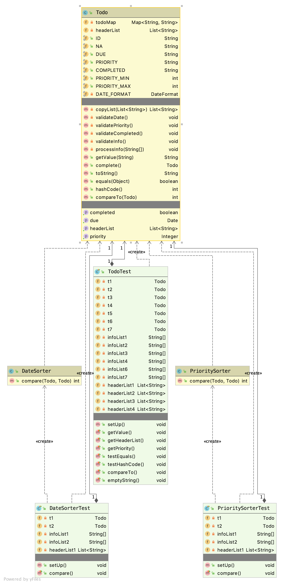
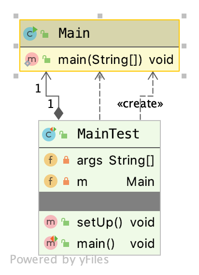
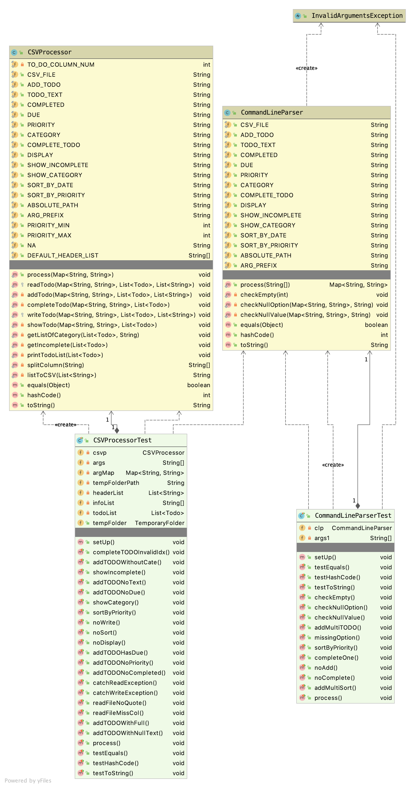

### Schedule Manger

Improvement from assignment8:
1.  using MVC architechture
2.  make the code more functional, try to make one function does only one thing
3.  using map to avoid so many fields in one class (Todo)

General Design:

1. View  
	Main: asks controller to process information,  and presents it

2. Controller :  take in user input, notify the model and view  

	CommandLineParser  
	CSVProcessor  

CommandLineParser    
	•	parse command line/option/argument  

CSVProcessor    
	•	read csv file  
	•	write/rewrite Model(TODO)  
	•	display Model(TODO)  

3. Model:      
	•	Todo: the data structure to store and retrieve data  
	⁃	default fields：   
		due: ?;		priority: 3;	completed: false  
	⁃	store TODO info inside a map  
	◦	i.e. id="1", text="Finish"  
	⁃	store TODO fields inside an array  
	◦	i.e. id, text, completed...  

	•	DateSorter: compare date between 2 TODO objects  

  	•	PrioritySorter: compare priority between 2 TODO objects  

