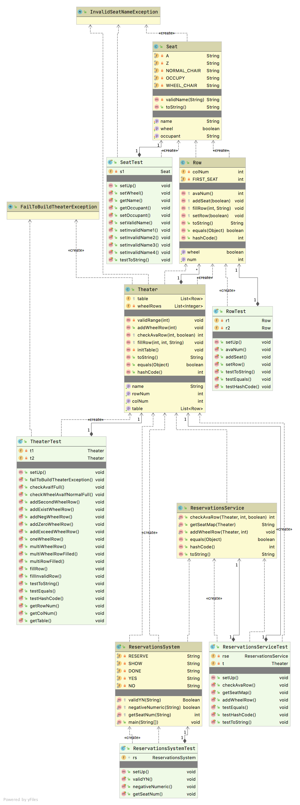

# Theater Reservation

- Seat
	- the element of row

- Row
	- the element of theater
	- type: `regular` row and `wheel chair accessible` row
	- if all regular rows are filled, the wheel accessible rows are included in consideration
	- best filled FIFO, best standard is determined by proximity to the center row

- Theater
	- is accessed by reserveation service

- ReservationService
	- implements operations to manipulate theater update

- ReservationSystem
	- implements operations to allow user type in
	- call reservation service to update theater

- Usage
	- reserve <number>
		- to reserve the number of seats
		- support reserve grouped seats in a single row
	- show
		- display the current available seating in the theater
	- done
		- shut down the reservation system

